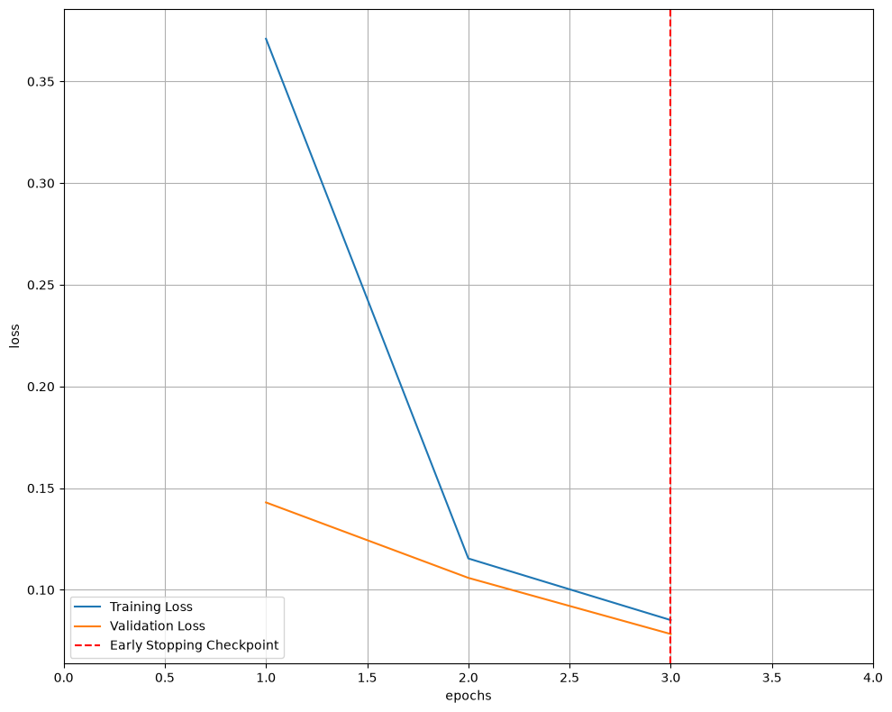
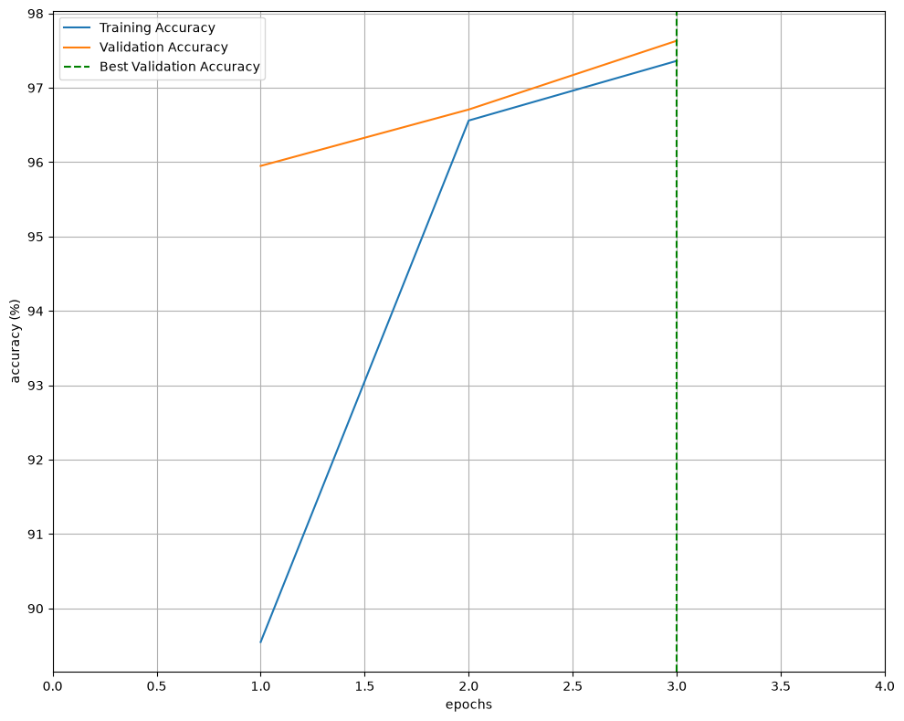
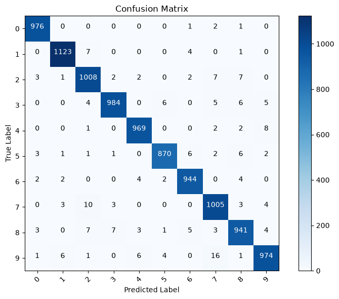
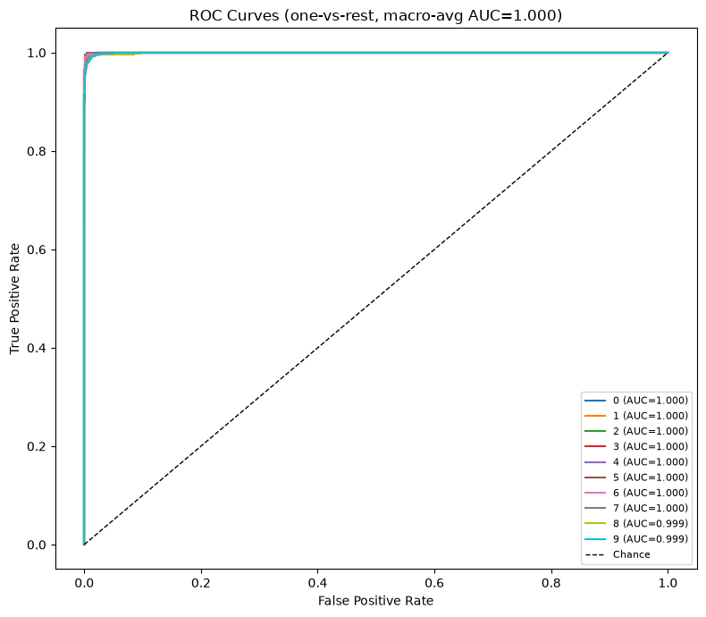
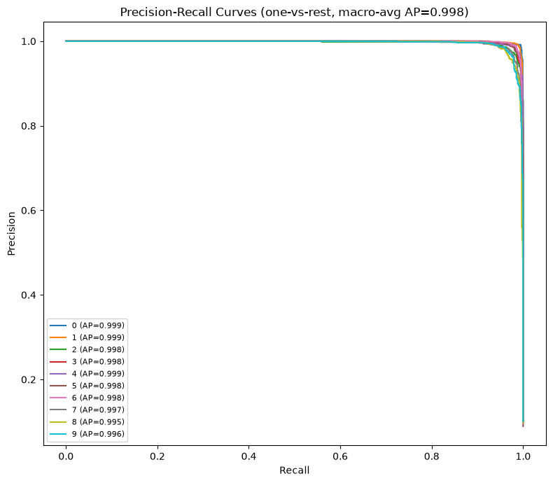

# Image Classification — PyTorch

A production-style, reusable image classification project, originally built around
MNIST. The training pipeline (data loading, metrics, trainer, checkpointing, CLI) is
fully decoupled from both the **dataset** and the **model architecture**, so switching
either is a one-line config change — no training code to touch.

> New to the codebase or prepping for an interview? See **[GUIDE.md](notebooks/GUIDE.md)**
> for the architecture deep-dive, every ML/DL term used here defined, and a
> Q&A covering both the deep learning concepts and the design decisions in this repo.

## Project Layout

```
HandWrittenDigitClassification/
├── configs/
│   └── default.yaml          # all hyperparameters & the active dataset/model name
├── src/
│   ├── dataio/                # named to avoid clashing with the raw MNIST cache at ./data/
│   │   ├── registry.py       # @register_dataset decorator + get_dataset_entry()
│   │   ├── datasets.py       # mnist, fashion_mnist, kmnist, cifar10, image_folder
│   │   └── dataset.py        # get_dataloaders(): dataset-agnostic train/valid/test loaders
│   ├── models/
│   │   ├── registry.py       # @register_model decorator + build_model() factory
│   │   ├── cnn.py            # simple_cnn, deep_cnn
│   │   ├── mlp.py            # mlp
│   │   └── resnet.py         # resnet18 (torchvision, adapted for 1-channel input)
│   ├── engine/
│   │   ├── trainer.py        # Trainer: train_one_epoch / evaluate / fit — model-agnostic
│   │   └── metrics.py        # accuracy, top-k accuracy, precision/recall/f1, per-class
│   │                         # classification report, confusion matrix
│   ├── utils/
│   │   ├── config.py         # YAML loading + CLI override merging
│   │   ├── checkpoint.py     # save/load checkpoints
│   │   ├── seed.py           # reproducibility
│   │   └── visualize.py      # loss/accuracy curves, confusion matrix, ROC/PR curves
│   ├── train.py               # CLI: python -m src.train --config ...
│   └── predict.py             # CLI: run inference on a single image
├── notebooks/
│   └── handwritten-classification.ipynb   # original exploratory notebook (unchanged)
├── tests/
│   ├── test_models.py         # every registered model builds + forwards correctly
│   └── test_metrics.py
├── app.py                     # Streamlit demo: draw/upload an image, classify with any checkpoint
└── requirements.txt
```

## Quickstart

```bash
pip install -r requirements.txt

# Train with the default architecture (simple_cnn)
python -m src.train --config configs/default.yaml

# Train a different architecture — no code changes needed
python -m src.train --config configs/default.yaml --set model.name=deep_cnn
python -m src.train --config configs/default.yaml --set model.name=resnet18 train.num_epochs=5
python -m src.train --config configs/default.yaml --set model.name=mlp

# Train on a different dataset — also no code changes needed
python -m src.train --config configs/default.yaml --set data.name=fashion_mnist
python -m src.train --config configs/default.yaml --set data.name=cifar10 model.name=resnet18

# Run inference on a single image with a trained checkpoint
python -m src.predict --config configs/default.yaml --image path/to/digit.png

# Run the test suite
python -m pytest
```

Each model+dataset combination gets its own set of output files automatically, so
experiments never clobber each other:

- `checkpoints/{model_name}_{dataset_name}_checkpoint.pth.tar` — best checkpoint
  (by validation loss), saved every run regardless of `train.load_checkpoint`.
- `outputs/{model_name}_{dataset_name}_loss_plot.png` — train/valid loss curves.
- `outputs/{model_name}_{dataset_name}_accuracy_plot.png` — train/valid accuracy curves.
- `outputs/{model_name}_{dataset_name}_confusion_matrix.png` — test-set confusion matrix.
- `outputs/{model_name}_{dataset_name}_roc_curve.png` — one-vs-rest ROC curve + AUC per class.
- `outputs/{model_name}_{dataset_name}_pr_curve.png` — one-vs-rest Precision-Recall curve + AP per class.
- `outputs/{model_name}_{dataset_name}_results.json` — test accuracy/precision/recall/f1,
  top-k accuracy, the full per-class classification report, and the paths above, for
  quick comparison across runs.

## Demo App (Streamlit)

Serve any trained checkpoint behind a UI — draw a digit or upload an image and get a
live prediction with a top-k probability chart:

```bash
streamlit run app.py
```

The app scans `checkpoints/*.pth.tar`, and for each file recovers which architecture
and dataset it was trained with by parsing the `{model_name}_{dataset_name}_checkpoint.pth.tar`
filename convention `train.py` writes (falls back to manual dropdowns if a checkpoint
doesn't follow that convention — e.g. one from the old notebook). Pick a checkpoint from
the sidebar, then classify via either tab:

- **Draw** — a freehand canvas (white on black, matching MNIST's convention) via
  `streamlit-drawable-canvas`; if that package isn't installed, this tab just shows an
  install hint and you can still use Upload.
- **Upload** — any image file; check "Invert colors" if it's a dark digit/object on a
  light background (e.g. a phone photo), since that's the opposite of MNIST's convention.

For datasets without a fixed class count in the registry (`image_folder`), the app
infers `num_classes` directly from the checkpoint's final layer shape rather than
requiring it in the config.

## Adding a New Architecture

1. Create `src/models/my_model.py`:
   ```python
   import torch.nn as nn
   from .registry import register_model

   @register_model("my_model")
   class MyModel(nn.Module):
       def __init__(self, in_channels=1, num_classes=10):
           ...
       def forward(self, x):
           ...
   ```
2. Import it in `src/models/__init__.py` (one line) so the decorator runs.
3. Train it: `python -m src.train --set model.name=my_model`.

The `Trainer`, dataloaders, metrics, checkpointing, and CLI require **no changes**.

## Adding a New Dataset

1. Register it in `src/dataio/datasets.py`:
   ```python
   @register_dataset("my_dataset", in_channels=3, image_size=64, num_classes=5)
   def build_my_dataset(root, transform, download):
       train = MyTrainDataset(root, transform=transform, download=download)
       test = MyTestDataset(root, transform=transform, download=download)
       return train, test
   ```
2. Train on it: `python -m src.train --set data.name=my_dataset`.

`model.in_channels` / `model.num_classes` are inferred automatically from the
dataset's registry metadata (so `resnet18` "just works" on both 1-channel MNIST
and 3-channel CIFAR-10), but can be overridden in the config if needed — e.g. for
`image_folder`, whose class count depends on however many subfolders exist under
`data.root/train`. `get_dataloaders()` and the `Trainer` never need to change.

## Design Notes

- **Registry pattern** (`src/models/registry.py`, `src/dataio/registry.py`) decouples
  "which architecture" and "which dataset" from "how training works" — new models
  and datasets are additive, never require editing the trainer or dataloader code.
- **Config-driven** (`configs/default.yaml` + `--set section.key=value` overrides) keeps
  experiments reproducible and diff-able instead of hardcoded notebook cells.
- **`Trainer` class** in `src/engine/trainer.py` centralizes the train/validate loop,
  checkpointing-on-improvement, and metric computation, replacing the notebook's
  free-floating functions and global state.
- The original exploratory notebook is preserved under `notebooks/` for reference.

## Results

Every run writes its metrics to `outputs/{model_name}_{dataset_name}_results.json`,
including a full per-class breakdown (`classification_report`) alongside the
macro-averaged numbers below. Example — `simple_cnn` on MNIST, 3 epochs:

| Metric           | Value  |
|------------------|--------|
| Accuracy         | 97.94% |
| Precision (macro)| 0.9794 |
| Recall (macro)   | 0.9793 |
| F1 (macro)       | 0.9793 |
| Top-3 Accuracy   | 99.84% |

The original notebook trained the same architecture for 50 epochs and also reached
~97%; `deep_cnn` and `resnet18` are included as stronger baselines to push past that.

**Per-class breakdown** (from `classification_report` in the same results file):

| Class | Precision | Recall | F1     | Support |
|-------|-----------|--------|--------|---------|
| 0     | 0.9879    | 0.9959 | 0.9919 | 980     |
| 1     | 0.9886    | 0.9894 | 0.9890 | 1135    |
| 2     | 0.9702    | 0.9767 | 0.9734 | 1032    |
| 3     | 0.9870    | 0.9743 | 0.9806 | 1010    |
| 4     | 0.9848    | 0.9868 | 0.9858 | 982     |
| 5     | 0.9853    | 0.9753 | 0.9803 | 892     |
| 6     | 0.9813    | 0.9854 | 0.9833 | 958     |
| 7     | 0.9645    | 0.9776 | 0.9710 | 1028    |
| 8     | 0.9681    | 0.9661 | 0.9671 | 974     |
| 9     | 0.9769    | 0.9653 | 0.9711 | 1009    |

**Loss & accuracy curves:**




**Confusion matrix:**



**ROC and Precision-Recall curves** (one-vs-rest per class, with AUC/AP):




> These images are generated by `python -m src.train` and committed here for
> reference — retrain to regenerate them for your own architecture/dataset combo,
> and swap the paths above to match (`outputs/{model_name}_{dataset_name}_*.png`).
